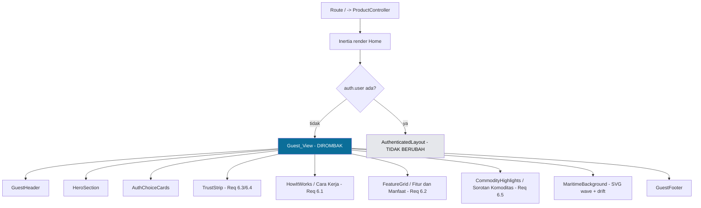
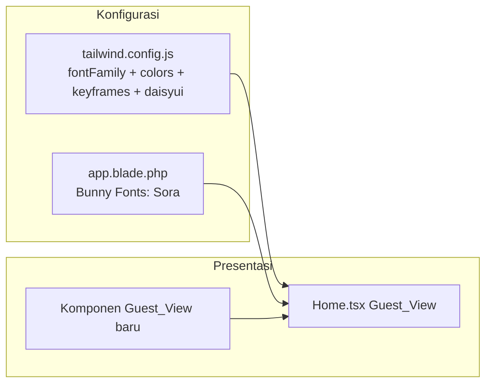

# Design Document

## Overview

Dokumen ini menjelaskan desain teknis untuk merombak total tampilan **Guest_View** pada Landing_Page Exporia (`resources/js/Pages/Home.tsx`). Redesign meninggalkan sepenuhnya konsep lama (latar `slate-950` gelap, glow orbs biru-indigo, hero terpusat, dan dua kartu glassmorphism), dan menggantinya dengan konsep visual baru bertema maritim ekspor-impor yang **terang, lapang, dan editorial**, namun tetap profesional dan modern.

Sasaran perubahan menyentuh lima area:

1. **Tipografi** — beralih dari "Plus Jakarta Sans" ke **"Sora"** (Requirement 1).
2. **Palet warna** — memperkenalkan triad warna maritim (biru laut primer, navi sekunder, emas hangat aksen) pada `tailwind.config.js` dan tema daisyUI, dengan kontras WCAG AA termasuk mode gelap (Requirement 2).
3. **Tata letak** — konsep komposisi baru untuk Guest_View (Requirement 3).
4. **Animasi** — animasi kemunculan, transisi hover, dan animasi latar berulang yang SSR-safe dan menghormati `prefers-reduced-motion` (Requirement 4), tanpa mengubah kontrak props, build, maupun performa (Requirement 5).
5. **Konten Informatif** — menambah bagian-bagian presentasi statis di bawah hero/auth agar Guest_View lebih informatif: indikator kepercayaan (trust strip), "Cara Kerja", "Fitur dan Manfaat", dan "Sorotan Komoditas" (Requirement 6). Seluruh teks dan angka di-hardcode di dalam berkas komponen (Bahasa Indonesia), bersifat ilustratif (bukan data backend), dan **tidak mengubah kontrak props** `Home.tsx`.

Prinsip yang dipegang sepanjang desain:

- **Tidak mengubah kontrak props** `Home.tsx` (`products`, `departemens`, `filters`, `auth`). Hanya cabang `!user` (Guest_View) yang dirombak; cabang terautentikasi (`AuthenticatedLayout`) dibiarkan utuh. Konten Informatif (Req 6) di-hardcode sebagai konstanta di dalam berkas komponen, bukan props baru.
- **SSR-safe**: build proyek menjalankan `vite build --ssr`. Semua animasi memakai CSS/Tailwind keyframes murni (tanpa `window`/`document`/`IntersectionObserver` saat render server), sehingga tidak ada referensi DOM browser pada saat render di server.
- **Tanpa dependensi animasi tambahan**: animasi diimplementasikan dengan CSS keyframes melalui konfigurasi Tailwind, sehingga `package.json` tidak perlu library animasi (memenuhi Req 5.2 secara default, dan menghindari risiko SSR dari library berbasis efek DOM).

## Konsep Desain Baru: "Horizon Dagang"

Konsep visual baru bernama **Horizon Dagang** — sebuah cakrawala maritim yang cerah, kebalikan langsung dari nuansa malam gelap pada desain lama.

Perbedaan mendasar dari desain lama:

| Aspek | Desain Lama (ditinggalkan) | Desain Baru "Horizon Dagang" |
|---|---|---|
| Latar | `bg-slate-950` gelap penuh | Terang: gradien sea-mist (`primary-50` → putih) dengan dukungan mode gelap navi |
| Aksen visual | Glow orbs blur biru/indigo | Gelombang SVG beranimasi di tepi bawah + grid kontur halus |
| Komposisi | Hero terpusat + 2 kartu glass di tengah | **Split asimetris**: kolom kiri konten editorial (eyebrow, judul, deskripsi, CTA), kolom kanan panel visual maritim + kartu pilihan |
| Warna brand | Biru-indigo (`#2563EB`) | Triad maritim: biru laut + navi + emas hangat |
| Font | Plus Jakarta Sans | Sora |
| Animasi | `animate-pulse` pada badge | Kemunculan bertahap (stagger), hover lift, gelombang & drift latar berulang |

### Wireframe Tata Letak (Desktop ≥ 1024px)

```
┌───────────────────────────────────────────────────────────────┐
│  HEADER:  [⚓ Exporia]                 [Masuk]  [Daftar →]       │
├───────────────────────────────────────────────────────────────┤
│                                  │                              │
│  ‹eyebrow chip›                  │   ┌───────────────────────┐  │
│  JUDUL HERO BESAR                │   │  Kartu: Masuk Akun     │  │
│  (Sora 700/800)                  │   │  ikon + teks + tombol  │  │
│                                  │   └───────────────────────┘  │
│  Deskripsi platform (1–300)      │   ┌───────────────────────┐  │
│                                  │   │  Kartu: Buat Akun Baru │  │
│  [ Mulai Sekarang → ] ‹CTA›      │   │  ikon + teks + tombol  │  │
│                                  │   (panel visual maritim)     │
├───────────────────────────────────────────────────────────────┤
│  TRUST STRIP  ‹3–4 metrik ilustratif statis›                    │
│   [10.000+ Produk] [1.200+ Vendor] [45+ Negara] [99% Aman]      │
├───────────────────────────────────────────────────────────────┤
│  CARA KERJA  ‹3–5 langkah bernomor›                             │
│   (1) Daftar  →  (2) Jelajahi  →  (3) Transaksi  →  (4) Kirim   │
├───────────────────────────────────────────────────────────────┤
│  FITUR & MANFAAT  ‹grid 3–6 butir›                              │
│   [Koneksi Langsung] [Transaksi Aman] [Jangkauan Global] ...    │
├───────────────────────────────────────────────────────────────┤
│  SOROTAN KOMODITAS  ‹3–8 chip kategori/komoditas›               │
│   [Kopi] [Rempah] [Hasil Laut] [Tekstil] [Kelapa Sawit] ...     │
├───────────────────────────────────────────────────────────────┤
│  ~~~~~ gelombang SVG beranimasi (continuous) ~~~~~              │
│  FOOTER:  © {tahun} Exporia ...                                 │
└───────────────────────────────────────────────────────────────┘
```

Aliran vertikal Guest_View dari atas ke bawah: **Header → Hero + AuthChoiceCards → Trust strip → Cara Kerja → Fitur dan Manfaat → Sorotan Komoditas → Footer**. Bagian-bagian Konten Informatif (Req 6) ditempatkan setelah area hero/auth agar pengunjung melihat ajakan bertindak terlebih dulu, kemudian memperoleh pendalaman informasi saat menggulir ke bawah. `MaritimeBackground` membentang sebagai lapisan latar di belakang seluruh bagian.

Pada viewport sempit (mobile, 360px), seluruh bagian ditumpuk satu kolom: header → hero → kartu pilihan → trust strip → cara kerja → fitur dan manfaat → sorotan komoditas → footer; grid multi-kolom (kartu, fitur, langkah) menyusut menjadi satu kolom sehingga tidak ada tumpang tindih maupun scroll horizontal (Req 6.9).

## Architecture

Landing_Page tetap dirender melalui pipeline yang sudah ada: **Laravel + Inertia → React (`Home.tsx`) → Vite (client + SSR build)**. Redesign bersifat presentational; tidak ada perubahan pada controller, route, maupun middleware.



Lapisan yang disentuh:



### Keputusan Arsitektur dan Rasionalnya

- **Animasi berbasis CSS keyframes (Tailwind), bukan library.** Rasional: build proyek melakukan SSR (`vite build --ssr`). Library animasi berbasis JS (mis. yang mengandalkan pengukuran DOM) berisiko mengakses API browser saat render server dan menambah beban bundle/LCP. CSS keyframes berjalan di GPU, SSR-safe, gratis dari sisi dependensi (mendukung Req 5.2, 5.3, 5.5), dan mudah dimatikan via media query `prefers-reduced-motion`.
- **Kemunculan hero tanpa ketergantungan JS state.** Animasi `fade/slide-up` dipicu murni oleh CSS `animation` saat elemen ter-mount (animasi berjalan begitu node masuk ke layout). Ini menghindari "flash" dan menjamin bila JS animasi gagal, elemen tetap berada di keadaan akhir (`animation-fill-mode: both` + nilai akhir = posisi natural), memenuhi Req 4.6 dan 4.7.
- **Komponen dipecah lokal di dalam folder Pages/Guest.** Komponen Guest_View baru ditempatkan sebagai komponen presentational tanpa state global, agar mudah diuji dan tidak mengganggu cabang terautentikasi.
- **Palet didefinisikan satu sumber kebenaran** di `tailwind.config.js` (`theme.extend.colors`) lalu dipetakan ke token tema daisyUI (`primary`/`secondary`/`accent`) agar konsisten antara utilitas Tailwind dan komponen daisyUI.

## Components and Interfaces

Semua komponen baru adalah komponen presentational (tanpa side-effect, tanpa akses DOM saat render) sehingga SSR-safe. Diletakkan di `resources/js/Pages/Home/components/` (atau di-inline pada `Home.tsx` bila ringkas). Kontrak props `Home.tsx` tidak berubah.

### `Home.tsx` (cabang Guest_View)

- **Input**: sama persis seperti sekarang — `{ products, departemens, filters, auth }`.
- **Perilaku**: jika `!auth.user`, render susunan komponen baru di bawah; selain itu render `AuthenticatedLayout` seperti sebelumnya (tidak diubah).

### `GuestHeader`

- **Tujuan**: header merek + tautan cepat.
- **Props**: tidak ada (statis).
- **Isi**: logo/wordmark "Exporia" (ikon jangkar/kontainer), tautan "Masuk" → `route('login')` dan tombol "Daftar" → `route('register')`.

### `HeroSection`

- **Tujuan**: kolom editorial kiri.
- **Props**: `{ description: string }` (string deskripsi platform, 1–300 karakter — dijaga konstan di kode, divalidasi oleh test).
- **Isi**: eyebrow chip, `<h1>` judul utama (Sora 800), paragraf deskripsi, CTA utama "Mulai Sekarang" → `route('register')`, dan trust strip (statistik singkat).
- **Animasi**: setiap anak menerima kelas `animate-rise` dengan `animation-delay` bertingkat (stagger) untuk efek kemunculan.

### `AuthChoiceCards`

- **Tujuan**: dua kartu pilihan.
- **Props**: tidak ada.
- **Isi**:
  - Kartu **"Masuk Akun"** → `Link href={route('login')}`.
  - Kartu **"Buat Akun Baru"** → `Link href={route('register')}`.
- **Animasi**: hover → `transition` transform/shadow (lift) dalam 100–400ms; leave → kembali ke keadaan awal dengan durasi yang sama.

### `TrustStrip` (Indikator Kepercayaan) — Req 6.3, 6.4

- **Tujuan**: menampilkan deretan metrik ilustratif statis untuk membangun kredibilitas.
- **Props**: tidak ada. Data berasal dari konstanta in-file `TRUST_METRICS` (lihat Data Models) — **bukan** props baru dan **bukan** data backend.
- **Isi**: 3–4 metrik, tiap metrik berupa `value` (string angka, boleh memuat pemisah ribuan/imbuhan satuan, mis. `"10.000+"`) dan `label` deskriptif (1–60 karakter). Menyertakan penanda visual/teks "Data ilustratif" untuk menegaskan bahwa angka bersifat ilustratif, bukan live (Req 6.4).
- **SSR-safe & reduced-motion**: presentational murni tanpa akses DOM; jika diberi animasi kemunculan, animasi mengikuti aturan `prefers-reduced-motion: reduce` (tampil langsung di keadaan akhir, Req 6.10).

### `HowItWorks` (Cara Kerja) — Req 6.1

- **Tujuan**: menjelaskan 3–5 langkah memulai aktivitas ekspor-impor.
- **Props**: tidak ada. Data dari konstanta in-file `HOW_IT_WORKS_STEPS`.
- **Isi**: tiap langkah memuat `number` (nomor urut menaik mulai dari 1, tanpa lompatan), `title` (1–100 karakter), dan `description` (1–200 karakter). Nomor urut dirender sesuai urutan array.
- **SSR-safe & reduced-motion**: presentational; animasi kemunculan (jika ada) dinonaktifkan saat reduced motion (Req 6.10).

### `FeatureGrid` (Fitur dan Manfaat) — Req 6.2

- **Tujuan**: grid 3–6 butir fitur/manfaat utama.
- **Props**: tidak ada. Data dari konstanta in-file `FEATURES`.
- **Isi**: tiap butir memuat `title` (1–100 karakter) dan `description` (1–200 karakter). Keseluruhan butir wajib mencakup tiga tema: **koneksi langsung antarpelaku usaha**, **keamanan transaksi**, dan **jangkauan pasar global** (Req 6.2).
- **Tata letak**: grid responsif (1 kolom di 360px, 2 kolom di 768px, 3 kolom di 1280px).
- **SSR-safe & reduced-motion**: presentational; animasi mengikuti `prefers-reduced-motion` (Req 6.10).

### `CommodityHighlights` (Sorotan Komoditas) — Req 6.5

- **Tujuan**: menonjolkan 3–8 kategori/komoditas unggulan.
- **Props**: tidak ada. Data dari konstanta in-file `COMMODITIES`.
- **Isi**: tiap entri memuat `name` (1–60 karakter), dirender sebagai chip/kartu ringkas.
- **Tata letak**: rangkaian chip yang membungkus (wrap) secara responsif tanpa scroll horizontal.
- **SSR-safe & reduced-motion**: presentational; animasi mengikuti `prefers-reduced-motion` (Req 6.10).

Catatan lintas-komponen Konten Informatif: seluruh teks ditulis dalam Bahasa Indonesia (Req 6.6), dirender dengan font "Sora" dan hanya memakai token Palet_Warna (Req 6.7), serta tidak menambah/mengubah props `Home.tsx` (Req 6.11).

### `MaritimeBackground`

- **Tujuan**: animasi latar belakang berulang (Req 4.4).
- **Props**: tidak ada.
- **Isi**: SVG gelombang berlapis yang bergeser horizontal secara loop mulus (`animation: wave linear infinite`) + lapisan gradien yang "drift" perlahan. Ditandai `aria-hidden="true"` dan `pointer-events-none`.
- **Reduced motion**: di-nonaktifkan via `@media (prefers-reduced-motion: reduce)` sehingga tampil statis.

### `GuestFooter`

- **Tujuan**: footer merek + hak cipta.
- **Props**: tidak ada.
- **Isi**: nama merek "Exporia" dan `© {new Date().getFullYear()} Exporia ...` (tahun dihitung dinamis), seluruh teks Bahasa Indonesia.

### Antarmuka Konfigurasi

`tailwind.config.js` (ekstensi):

```js
theme: {
  extend: {
    fontFamily: {
      sans: ['Sora', ...defaultTheme.fontFamily.sans], // Req 1.3
    },
    colors: {
      primary:   '#0B6E99', // Req 2.1, 2.2
      secondary: '#0A3D62', // Req 2.1
      accent:    '#F4A91F', // Req 2.1, 2.3
      // token neutral pendukung (bagian dari Palet_Warna, Req 2.4)
      surface:   '#F2FAFD',
      ink:        '#0B1F2A',
    },
    keyframes: {
      rise:  { '0%': { opacity: '0', transform: 'translateY(16px)' },
               '100%': { opacity: '1', transform: 'translateY(0)' } },
      wave:  { '0%': { transform: 'translateX(0)' },
               '100%': { transform: 'translateX(-50%)' } },
      drift: { '0%,100%': { transform: 'translate3d(0,0,0)' },
               '50%': { transform: 'translate3d(0,-12px,0)' } },
    },
    animation: {
      rise:  'rise 600ms ease-out both',   // 200–800ms (Req 4.1), fill both (Req 4.7)
      wave:  'wave 18s linear infinite',   // latar berulang (Req 4.4)
      drift: 'drift 12s ease-in-out infinite',
    },
  },
}
```

`app.blade.php` (font):

```html
<link rel="preconnect" href="https://fonts.bunny.net">
<link href="https://fonts.bunny.net/css?family=sora:400,500,600,700,800&display=swap" rel="stylesheet" />
```

`display=swap` memenuhi Req 1.4 (tanpa FOIT — teks tampil dengan fallback hingga Sora termuat).

## Data Models

Redesign ini bersifat presentational dan tidak memperkenalkan model data baru maupun mengubah skema yang ada. Struktur data yang relevan hanya kontrak props (tidak berubah) dan token desain.

### Kontrak Props (tetap)

```ts
interface Props extends PageProps {
  products: PaginationProps<Product>;
  departemens: Array<{ id: number; name: string }>;
  filters: { search?: string; departemen_id?: string };
  // auth disediakan oleh PageProps; auth.user menentukan guest vs authenticated
}
```

### Konstanta Konten Informatif (statis, in-file) — Req 6

Konten Informatif **tidak** berasal dari backend dan **tidak** menambah props. Seluruhnya didefinisikan sebagai konstanta yang di-hardcode di dalam berkas komponen Guest_View (mis. `Home.tsx` atau berkas komponen di `Pages/Home/components/`). Tipe di bawah hanya mendeskripsikan bentuk konstanta lokal, bukan kontrak data eksternal.

```ts
// Langkah pada bagian "Cara Kerja" (Req 6.1): 3–5 entri,
// number menaik mulai dari 1 tanpa lompatan.
interface HowItWorksStep {
  number: number;       // 1, 2, 3, ... berurutan
  title: string;        // 1–100 karakter
  description: string;  // 1–200 karakter
}
const HOW_IT_WORKS_STEPS: HowItWorksStep[] = [ /* 3–5 entri (Bahasa Indonesia) */ ];

// Butir pada bagian "Fitur dan Manfaat" (Req 6.2): 3–6 entri,
// wajib mencakup koneksi langsung, keamanan transaksi, jangkauan global.
interface Feature {
  title: string;        // 1–100 karakter
  description: string;  // 1–200 karakter
}
const FEATURES: Feature[] = [ /* 3–6 entri (Bahasa Indonesia) */ ];

// Metrik ilustratif pada trust strip (Req 6.3, 6.4): 3–4 entri.
// value adalah string (boleh memuat pemisah ribuan/imbuhan satuan).
// Nilai bersifat ILUSTRATIF dan TIDAK ditarik dari backend.
interface TrustMetric {
  value: string;        // mis. "10.000+", "45", "1.200+"
  label: string;        // 1–60 karakter, mis. "Produk terdaftar"
}
const TRUST_METRICS: TrustMetric[] = [ /* 3–4 entri (Bahasa Indonesia) */ ];

// Sorotan komoditas/kategori (Req 6.5): 3–8 entri.
interface Commodity {
  name: string;         // 1–60 karakter
}
const COMMODITIES: Commodity[] = [ /* 3–8 entri (Bahasa Indonesia) */ ];
```

Batasan jumlah dan panjang di atas (3–5 langkah, 3–6 fitur, 3–4 metrik, 3–8 komoditas, serta batas karakter) divalidasi melalui example/config test (lihat Testing Strategy), bukan melalui PBT. Karena konstanta ini bukan props dan tidak mengubah `Home.tsx` `Props`, kontrak props tetap utuh (Req 6.11).

### Token Desain (Palet_Warna)

| Token | Hex | Hue (≈) | Peran | Catatan kontras |
|---|---|---|---|---|
| `primary` | `#0B6E99` | 198° | warna primer (biru laut) | teks putih di atasnya ≈ 5.67:1 (AA normal) |
| `secondary` | `#0A3D62` | 205° | navi, judul/teks gelap | teks putih di atasnya ≈ 11:1 |
| `accent` | `#F4A91F` | 39° | emas hangat, CTA/sorotan | gunakan teks gelap (`secondary`/`ink`) ≈ 10.5:1; teks putih TIDAK boleh (≈ 2:1) |
| `surface` | `#F2FAFD` | — | latar terang | teks `ink`/`secondary` ≈ AA terpenuhi |
| `ink` | `#0B1F2A` | — | teks utama mode terang | di atas `surface`/putih ≈ AAA |

### Pemetaan Tema daisyUI

| Mode | Sumber | `primary` | `secondary` | `accent` | base/text |
|---|---|---|---|---|---|
| light | override `light` | `#0B6E99` | `#0A3D62` | `#F4A91F` | base terang, teks `ink` |
| dark | override `dark` | `#3BA7CE` (primer dicerahkan agar AA pada latar navi) | `#7FB2CC` | `#F6B73C` | base navi gelap, teks terang |

Mode gelap memakai versi warna primer/aksen yang dicerahkan agar tetap memenuhi kontras 4.5:1 (teks normal) dan 3:1 (teks besar) di atas latar navi gelap (Req 2.6).

## Error Handling

Karena Guest_View adalah UI presentational tanpa I/O, penanganan kesalahan berfokus pada degradasi anggun:

- **Font gagal/lambat dimuat (Req 1.4)**: `display=swap` pada URL Bunny Fonts memastikan teks segera tampil dengan fallback `sans-serif` sistem; tidak ada FOIT. Stack fallback didefinisikan setelah "Sora" pada `fontFamily.sans`.
- **Animasi kemunculan gagal mulai (Req 4.7)**: kelas `animate-rise` memakai `animation-fill-mode: both` dan keadaan akhir (`opacity:1; translateY(0)`) identik dengan posisi natural elemen. Bila animasi tidak berjalan (mis. mesin animasi dimatikan), elemen tetap tampil penuh di posisi akhir.
- **Preferensi reduced motion (Req 4.5)**: blok `@media (prefers-reduced-motion: reduce)` menonaktifkan `rise`, `wave`, dan `drift` (`animation: none`), menampilkan semua konten langsung tanpa gerak.
- **Tanpa layout shift (Req 4.6)**: animasi hanya menggunakan properti `transform` dan `opacity` (composited), tidak memengaruhi aliran tata letak; ukuran kontainer dipesan sejak awal sehingga posisi akhir = posisi sebelum animasi.
- **Kegagalan build TypeScript (Req 5.3, 5.7)**: skrip `tsc && vite build && vite build --ssr` akan gagal dengan exit code ≠ 0 dan menampilkan berkas/baris penyebab; tidak ada artefak yang dihasilkan bila `tsc` gagal. Komponen ditulis dengan tipe eksplisit agar lolos `tsc`.
- **Akses elemen browser saat SSR**: komponen Guest_View tidak mengakses `window`/`document` saat render. `new Date().getFullYear()` aman dijalankan di server dan klien.

## Testing Strategy

### Penilaian Kelayakan Property-Based Testing (PBT)

Fitur ini **didominasi oleh UI rendering, tata letak, konfigurasi gaya (font/warna), dan animasi CSS**. Mengacu pada panduan workflow, area berikut **tidak cocok** untuk PBT:

- **UI rendering & layout** (hero, kartu, header, footer, responsivitas) → gunakan snapshot/example test dan pengujian responsif manual/otomatis.
- **Konfigurasi** (font Sora di `app.blade.php`, token warna & keyframes di `tailwind.config.js`) → gunakan validasi konfigurasi/example test.
- **Konten Informatif statis** (Req 6 — langkah Cara Kerja, butir Fitur/Manfaat, metrik trust strip, sorotan komoditas) → konstanta tetap; gunakan example/config test untuk batas jumlah, batas panjang, dan cakupan tema.
- **Animasi** (kemunculan, hover, latar berulang, reduced-motion) → perilaku visual/temporal, diverifikasi via example test + pemeriksaan manual.
- **Build & kompatibilitas peramban** (Req 5.3/5.6/5.7) → smoke test (`npm run build`) dan pengujian lintas-peramban manual.

Tidak ada akseptansi yang berbentuk "untuk semua input X, properti P(X) berlaku" pada logika kode kita — Guest_View tidak melakukan transformasi data, parsing, serialisasi, atau algoritma yang bervariasi terhadap input. Palet warna adalah himpunan tetap (bukan input yang bervariasi); pemeriksaan kontrasnya adalah pemeriksaan example pada nilai tetap, bukan properti universal. Konten Informatif (Req 6) yang baru ditambahkan juga tetap berupa konstanta presentasi statis yang di-hardcode (langkah, fitur, metrik, komoditas) — bukan fungsi yang menerima input bervariasi — sehingga validasinya berupa example/config test atas nilai tetap, bukan PBT.

**Kesimpulan: PBT TIDAK diterapkan untuk fitur ini.** Bagian "Correctness Properties" sengaja dihilangkan. Pengujian memakai kombinasi example test, snapshot test, smoke test, dan pemeriksaan manual.

### Lapisan Pengujian

**1. Example/Component test (mis. Vitest + React Testing Library jika ditambahkan, atau verifikasi manual bila harness belum ada)**

- Guest_View merender header dengan merek "Exporia". (Req 3.4)
- Hero merender judul, deskripsi (panjang 1–300 karakter), dan CTA dengan `href` ke `route('register')`. (Req 3.1)
- Kartu "Masuk Akun" memiliki `href` ke `route('login')`; kartu "Buat Akun Baru" ke `route('register')`. (Req 3.2, 3.3, 6 lama)
- Footer memuat "Exporia" dan tahun berjalan (`new Date().getFullYear()`). (Req 3.4)
- Seluruh teks Guest_View dalam Bahasa Indonesia. (Req 5.4)
- Saat `auth.user` ada, cabang `AuthenticatedLayout` tetap dirender (regresi). (Req 5.1)
- Guest_View merender keempat bagian Konten Informatif: trust strip, "Cara Kerja", "Fitur dan Manfaat", dan "Sorotan Komoditas". (Req 6.1, 6.2, 6.3, 6.5)
- Kontrak props `Home.tsx` tidak berubah meski Konten Informatif ditambahkan (snapshot tipe `Props` / pemeriksaan tidak ada props baru). (Req 6.11)

**1b. Pemeriksaan Konten Informatif statis (example/config test atas konstanta in-file)** — Req 6

- **Cara Kerja** (`HOW_IT_WORKS_STEPS`): jumlah entri ∈ [3,5]; setiap `title` 1–100 karakter; setiap `description` 1–200 karakter; `number` menaik berurutan tanpa lompatan mulai dari 1 (`steps[i].number === i + 1`). (Req 6.1)
- **Fitur dan Manfaat** (`FEATURES`): jumlah entri ∈ [3,6]; setiap `title` 1–100 karakter; `description` 1–200 karakter; gabungan teks mencakup tiga tema wajib — koneksi langsung antarpelaku usaha, keamanan transaksi, dan jangkauan pasar global (verifikasi via kata kunci representatif). (Req 6.2)
- **Trust strip** (`TRUST_METRICS`): jumlah entri ∈ [3,4]; setiap `value` non-kosong (boleh memuat pemisah ribuan/imbuhan satuan); setiap `label` 1–60 karakter. (Req 6.3)
- **Metrik ilustratif, bukan backend**: konstanta `TRUST_METRICS` didefinisikan statis di berkas komponen dan tidak dirujuk dari props `Home.tsx` (`products`/`departemens`/`filters`/`auth`); komponen `TrustStrip` tidak menerima props data. Sertakan penanda "Data ilustratif" yang terlihat. (Req 6.4)
- **Sorotan Komoditas** (`COMMODITIES`): jumlah entri ∈ [3,8]; setiap `name` 1–60 karakter. (Req 6.5)
- **Bahasa Indonesia**: seluruh teks pada konstanta Konten Informatif berbahasa Indonesia, tanpa teks bahasa lain pada elemen terlihat. (Req 6.6)

**2. Pemeriksaan konfigurasi (example test/inspeksi)**

- `tailwind.config.js`: `fontFamily.sans[0] === 'Sora'`; mendefinisikan tepat satu `primary`, `secondary`, `accent` dengan hex eksplisit; tidak ada referensi "Inter"/"Plus Jakarta Sans". (Req 1.1, 1.3, 1.5, 2.1)
- `app.blade.php`: memuat `sora:400,500,600,700,800` dari Bunny Fonts dengan `display=swap`; tidak ada "plus-jakarta-sans"/"Inter". (Req 1.2, 1.4, 1.5)
- Hue primer ∈ [180°,260°] dan hue aksen ∈ [20°,60°] (hitung dari hex). (Req 2.2, 2.3)

**3. Pemeriksaan kontras warna (example test pada pasangan tetap)**

- Hitung rasio kontras (algoritma WCAG 2.1) untuk pasangan teks/latar yang digunakan di Guest_View pada mode terang dan gelap; verifikasi ≥ 4.5:1 (teks normal) dan ≥ 3:1 (teks besar). Termasuk: teks putih atas `primary`, teks gelap atas `accent`, teks `ink` atas `surface`, dan padanan mode gelap. (Req 2.5, 2.6)
- Pasangan teks/latar pada bagian Konten Informatif (judul & deskripsi langkah, kartu fitur, nilai & label metrik trust strip, chip komoditas) hanya memakai token Palet_Warna dan memenuhi kontras ≥ 4.5:1 (teks normal) / ≥ 3:1 (teks besar). (Req 6.7, 6.8)

**4. Pengujian animasi (example + manual)**

- Kelas/keyframe `rise` berdurasi 200–800ms dan memakai `fill-mode: both`. (Req 4.1, 4.7)
- Hover pada kartu/CTA memicu transisi 100–400ms dan kembali saat leave. (Req 4.2, 4.3)
- `MaritimeBackground` menjalankan animasi `infinite` tanpa jeda terlihat. (Req 4.4)
- Dengan `prefers-reduced-motion: reduce`, semua animasi non-esensial nonaktif dan konten tampil di keadaan akhir. Termasuk seluruh bagian Konten Informatif (trust strip, Cara Kerja, Fitur dan Manfaat, Sorotan Komoditas) tampil langsung tanpa gerak. (Req 4.5, 6.10)
- Animasi hanya `transform`/`opacity` → tidak ada layout shift; verifikasi posisi akhir = posisi natural. (Req 4.6)

**5. Smoke test & responsif**

- `npm run build` mengembalikan exit code 0 tanpa galat TypeScript; build SSR berhasil. (Req 5.3, 5.7)
- Pemeriksaan responsif pada lebar 360px, 768px, 1280px: tidak ada tumpang tindih/scroll horizontal. Mencakup grid bagian Konten Informatif (kartu fitur, langkah Cara Kerja, chip komoditas) yang menyusut menjadi satu kolom / membungkus dengan rapi di 360px. (Req 3.5, 6.9)
- Pemeriksaan lintas-peramban (Chrome, Firefox, Safari, Edge versi terbaru): seluruh elemen Guest_View tampil tanpa galat rendering. (Req 5.6)
- LCP ≤ 2.5s pada 4G — diverifikasi via Lighthouse/throttling (pemeriksaan manual). (Req 5.5)

### Catatan Verifikasi

- Pengujian kontras dan hue dapat diimplementasikan sebagai unit test murni atas fungsi konversi hex→HSL/luminance, karena ini deterministik dan berguna untuk mencegah regresi palet.
- Bila proyek belum memiliki harness test JS (`package.json` saat ini tanpa runner test), penambahan runner (mis. Vitest) bersifat opsional; jika ditambahkan, versi harus di-pin (Req 5.2). Bila tidak, verifikasi konfigurasi/kontras dilakukan via skrip Node sekali jalan dan pemeriksaan manual, dan smoke test build tetap wajib.
